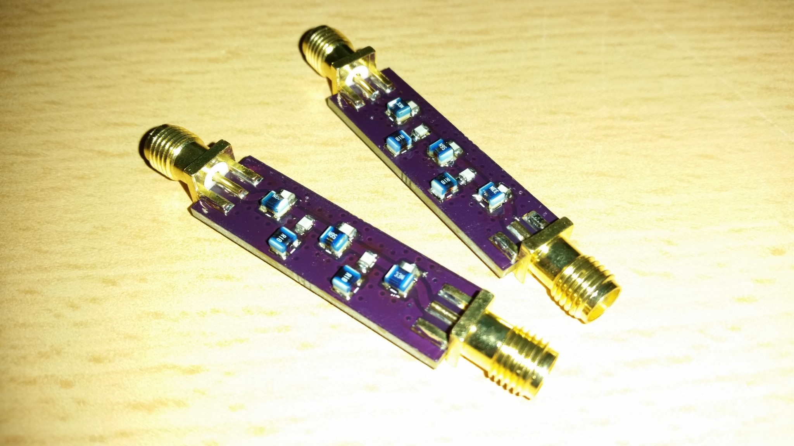
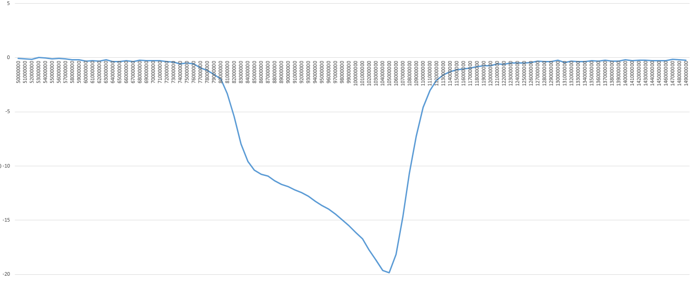

# FM Trap

[OSHPark Project](https://oshpark.com/shared_projects/sTO339dT)

## Characteristics

## BOM

 - 2x [1008 33nH](https://www.tme.eu/en/details/cw1008-33/smd-coils/ferrocore/)
 - 2x [1008 180nH](https://www.tme.eu/en/details/cw1008-180/smd-coils/ferrocore/)
 - 1x [1008 56nH](https://www.tme.eu/en/details/cw1008-56/smd-coils/ferrocore/)
 - 2x [0805 82pF](https://www.tme.eu/en/details/cc0805jrnpo9820/0805-mlcc-smd-capacitors/yageo/cc0805jrnpo9bn820/)
 - 2x [0805 15pF](https://www.tme.eu/en/details/cc0805jrnpo9150/0805-mlcc-smd-capacitors/yageo/cc0805jrnpo9bn150/)
 - 1x [0805 47pF](https://www.tme.eu/en/details/cc0805jrnpo9470/0805-mlcc-smd-capacitors/yageo/cc0805jrnpo9bn470/)
 - 2x [SMA](https://www.ebay.com/sch/i.html?_from=R40&_sacat=0&_nkw=sma+female+pcb+edge+mount&rt=nc&LH_BIN=1)
 - 1x [PCB](https://oshpark.com/shared_projects/sTO339dT)

## Other Projects

 - [2m Band Pass Filter](https://github.com/kolaCZek/2m-Band-Pass-Filter)
 - [2m/70cm Diplexer](https://github.com/kolaCZek/2m-70cm-Diplexer)
 - [Bias-T](https://github.com/kolaCZek/Bias-T)

## License

[Apache License Version 2.0](./LICENSE)

## Donate

